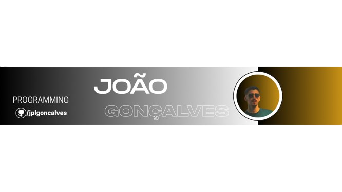

  <!-- Cabeçalho oficial Dark & Green -->
  

  <!-- Mão real a acenar -->
  <h1>Olá, eu sou o João Gonçalves! </h1>

  

    
  

---

  

---

## 🚀 Engenharia de Sistemas & Projetos Principais

| Projeto | Descrição Técnica | Stack / Status |
| :--- | :--- | :--- |
| **[Snakened](https://github.com/jplgoncalves/snakened)** | Criação de uma linguagem de programação completa. Inclui motor de cálculo e integração nativa com VS Code. | 🐍 `Python`   🟢 *Lançado (27 Mar 2026)* |
| **[Gonix](https://github.com/jplgoncalves/gonix)** | Desenvolvimento de um micro-sistema operativo independente, focado na arquitetura de baixo nível. | ⚙️ `Assembly`   🟢 *Lançado (1 Abr 2026)* |
| **[AprenderMais](https://github.com/jplgoncalves/aprendermais-platform)** | Plataforma educativa completa, estruturada por etapas de ensino e disciplinas do currículo português. | 🌐 `Web Platform`   🟢 *Lançado (27 Jul 2026)* |

---

## 🛠️ Stack Tecnológica Completa

### 💻 Linguagens & Sistemas

  
  
  
  
  
  
  
  
  
  
  
  
  

### 🌐 Web & Dados

  
  
  
  
  
  

### ⚙️ Ferramentas & SO

  
  
  
  
  
  
  

---

  
<i>Obrigado por visitar o meu perfil. Construindo o futuro, linha por linha.</i>

